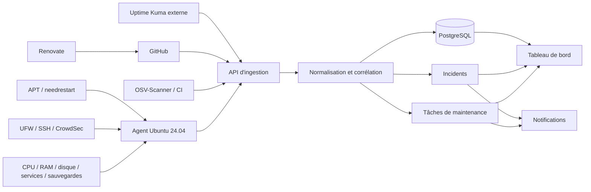

# Module — Monitoring et opérations

## Objectif

Détecter rapidement une dégradation, présenter un diagnostic exploitable et organiser la résolution sans transformer chaque anomalie en bruit.

Le produit n'a pas vocation à remplacer les outils spécialisés. Il constitue un cockpit qui agrège leurs résultats, normalise les constats, corrèle les événements et transforme les problèmes nécessitant une intervention en incidents ou en tâches de maintenance.

## Décisions actées

- les dépôts applicatifs sont hébergés sur GitHub ;
- le serveur cible utilise Ubuntu Server 24.04 LTS ou Debian ;
- les intégrations du premier incrément sont en lecture seule ;
- le monitoring de disponibilité est exécuté hors du VPS surveillé ;
- les correctifs sûrs peuvent être automatisés, mais les changements risqués créent une tâche à valider ;
- chaque résultat indique sa source et la date de sa dernière collecte ;
- la vue VPS affiche la fréquence de collecte configurée, la date du dernier rapport, la prochaine collecte attendue et signale clairement une donnée périmée ;
- la V1 est destinée à un seul utilisateur administrateur ;
- la V1 utilise des notifications dans l'application et des notifications Web Push ;
- les notifications par email sont reportées à la mise en production réelle ;
- les technologies d'une application sont détectées depuis son dépôt GitHub, déclarées manuellement ou combinées puis confirmées par l'utilisateur.

## Architecture cible d'agrégation



### Composants du cockpit

- **API d'ingestion** : reçoit les webhooks et les rapports des intégrations, avec authentification et idempotence ;
- **worker** : planifie les collectes, applique les règles, détecte les silences et corrèle les constats ;
- **PostgreSQL** : conserve ressources, observations, constats, incidents, tâches et journal d'audit ;
- **interface web** : fournit une vue agence, une vue projet, une boîte de réception des actions et l'historique ;
- **notifier** : enregistre les notifications internes et distribue les Web Push selon la gravité, le projet et les périodes de silence ;
- **agent VPS** : collecte localement avec le minimum de privilèges et initie uniquement des connexions sortantes vers l'API.

Le cockpit et le contrôle de disponibilité externe ne doivent pas être hébergés uniquement sur le VPS surveillé. Une panne réseau, disque ou système de ce VPS doit rester visible depuis l'extérieur.

## Sources spécialisées retenues

| Domaine | Source recommandée | Données agrégées |
|---|---|---|
| Disponibilité | Uptime Kuma | HTTP, mot-clé, JSON, TCP, DNS, heartbeat, TLS et latence |
| Ressources VPS | Agent local ou Node Exporter | CPU, mémoire, swap, charge, disque, inodes, réseau et uptime |
| Système Ubuntu | APT, unattended-upgrades et needrestart | correctifs disponibles/appliqués, paquets retenus et redémarrage requis |
| Sécurité hôte | UFW, journaux SSH et CrowdSec | exposition réseau, échecs d'authentification, décisions et état de protection |
| Dépendances | Renovate et GitHub | mises à jour proposées, PR, version majeure et dépendance abandonnée |
| Vulnérabilités | GitHub Dependabot et OSV-Scanner | avis de sécurité, paquet affecté, version corrigée et niveau de confiance |
| Déploiements | Coolify et GitHub Actions | version déployée, résultat, date et échec de pipeline |
| Sauvegardes | Script ou outil de sauvegarde existant | dernière sauvegarde, taille, résultat et dernier test de restauration |

## Utilisateur et authentification

### V1 — administrateur unique

- un seul compte peut accéder au cockpit ;
- ce compte possède toutes les permissions de consultation et de configuration ;
- aucune interface de gestion des rôles, équipes ou invitations n'est construite ;
- l'authentification, les sessions, la révocation et le journal d'audit restent obligatoires ;
- les secrets GitHub, Web Push et agents ne sont jamais exposés au navigateur.

Même avec un seul utilisateur, les tables métier reçoivent dès la V1 un `workspace_id` et les actions un `actor_id`. En V1, ils pointent toujours vers l'espace et l'utilisateur uniques. Cela prépare la V2 sans introduire dès maintenant une interface ou des règles d'autorisation multi-utilisateur.

### Préparation V2

La V2 pourra ajouter invitations, rôles, responsables multiples et cloisonnement par espace de travail. Toutes les requêtes devront alors être filtrées par `workspace_id`, avec des autorisations explicites pour la lecture, la configuration, l'acquittement et les opérations sensibles.

## Détection des technologies applicatives

### Sources de détection

Le scanner GitHub inspecte uniquement les fichiers nécessaires et reconnaît notamment :

- `package.json` et les lockfiles npm, pnpm, Yarn ou Bun ;
- `pyproject.toml`, `requirements*.txt`, Pipenv et Poetry ;
- `composer.json`, `Gemfile`, `go.mod`, `Cargo.toml` et fichiers équivalents ;
- `Dockerfile`, fichiers Compose et images de base ;
- fichiers de runtime tels que `.nvmrc`, `.node-version`, `.python-version` et `mise.toml` ;
- dépendances caractéristiques permettant d'inférer un framework, par exemple Next.js, Nuxt, Django, Laravel ou Rails ;
- fichiers d'infrastructure et de déploiement pertinents, sans lire de secrets.

Une détection comporte toujours une preuve, un niveau de confiance, la branche et le commit analysés. Par exemple : `Next.js détecté via package.json au commit abc123`.

### Fusion entre détection et déclaration manuelle

Chaque technologie possède une origine et un état :

| Origine | Signification |
|---|---|
| Détectée | trouvée automatiquement dans le dépôt |
| Déclarée | ajoutée manuellement par l'utilisateur |
| Confirmée | détection ou déclaration validée lors de la configuration |
| Ignorée | détection volontairement exclue du monitoring |

Une nouvelle analyse ne supprime jamais silencieusement un choix manuel. En cas de divergence, elle crée un constat à confirmer, par exemple « Node 20 déclaré, Node 22 détecté dans le Dockerfile ».

### Parcours de création d'un monitoring d'application

1. Renseigner le nom, l'environnement et l'URL publique de l'application.
2. Sélectionner le dépôt GitHub et la branche suivie.
3. Lancer la détection des technologies et afficher les preuves trouvées.
4. Confirmer, corriger, ajouter ou ignorer les technologies proposées.
5. Configurer les contrôles de disponibilité et le healthcheck métier.
6. Choisir les seuils, la criticité et les règles de maintenance.
7. Tester les contrôles et la notification Web Push avant activation.

Le profil technologique confirmé détermine ensuite les scanners, les sources de fin de support et les règles de mise à jour applicables.

## Modèle d'exécution

```text
source spécialisée
  → observation brute
  → constat normalisé
  → règle de gravité et de déduplication
  → incident immédiat OU tâche de maintenance
  → notification éventuelle
  → résolution automatique ou validation humaine
```

Les observations brutes restent disponibles pour le diagnostic. Un constat utilise un vocabulaire commun, quelle que soit sa source : `availability`, `capacity`, `security`, `dependency`, `backup`, `deployment` ou `lifecycle`.

## Périmètre MVP

### Healthchecks

- HTTP/HTTPS : statut, latence, redirections, contenu attendu et validité TLS ;
- TCP : accessibilité d’un port explicitement autorisé ;
- heartbeat : réception attendue d’un signal émis par un job ;
- contrôle métier simple : endpoint dédié vérifiant les dépendances essentielles ;
- fréquence, délai, nombre d’échecs consécutifs et localisations paramétrables.

Un endpoint métier ne doit pas exposer de secret ni de données client. Il distingue si possible application, base, stockage et services externes.

### Coolify et déploiements

L’adaptateur Coolify vise d’abord la lecture :

- disponibilité de l’instance Coolify ;
- inventaire des ressources associées au projet ;
- état courant des applications, bases et services ;
- dernier déploiement, résultat, version et date ;
- événements de redémarrage ou échec disponibles ;
- lien profond vers Coolify pour l’intervention.

Les opérations d’écriture, redéploiement ou redémarrage ne font pas partie du premier incrément.

### VPS

Mesures minimales : CPU, mémoire, espace disque et inodes, charge, uptime, connectivité, dérive de l’horloge et état de l’agent de collecte. Les seuils sont adaptés au serveur et utilisent une durée avant alerte afin d’éviter les pics sans conséquence.

### Dépendances

Le système inventorie les manifests et lockfiles, puis distingue :

- mise à jour disponible ;
- version majeure nécessitant une étude ;
- dépendance abandonnée ou non maintenue ;
- vulnérabilité connue et niveau de confiance ;
- runtime ou image de base arrivant en fin de support.

L’état « à jour » doit comporter une date de dernière analyse et la source utilisée. Une découverte crée une tâche ou enrichit une tâche existante selon une clé de regroupement.

## Modèle d’un contrôle

| Champ | Description |
|---|---|
| Identité | nom, type, projet, environnement et ressource |
| Attendu | règle de succès et seuils |
| Planification | fréquence, délai, jitter et localisations |
| Politique d’incident | nombre d’échecs, regroupement, gravité |
| Routage | responsable, canal, escalade |
| Maintenance | fenêtres et suppressions prévues |
| Dernier état | sain, dégradé, en panne, inconnu, suspendu |
| Observation | date, durée, résultat et erreur normalisée |

## Cycle d’incident

`detected → open → acknowledged → mitigated → resolved → reviewed`

- Une récupération automatique peut résoudre l’incident selon la politique, mais ne supprime pas l’historique.
- Une maintenance planifiée suspend les notifications, pas la collecte ni l’audit.
- Plusieurs checks peuvent être corrélés à un seul incident.
- Une alerte indique impact, ressource, première observation, dernière observation, changement récent pertinent et action attendue.

## Gravité initiale

| Niveau | Exemple | Réponse attendue |
|---|---|---|
| Critique | Production indisponible ou perte de données probable | Notification immédiate et escalade |
| Élevée | Fonction essentielle dégradée, disque bientôt saturé | Prise en charge rapide |
| Moyenne | Redondance perdue, mise à jour de sécurité importante | Tâche avec échéance |
| Faible | Mise à jour mineure, information de capacité | Backlog / rapport |

La criticité du projet module la gravité finale.

## Notifications V1

### Centre de notifications interne

Chaque notification est persistée avant sa diffusion et apparaît dans une boîte de réception avec état lu/non lu. Lorsque l'application est ouverte, les nouveaux événements sont transmis en temps réel au navigateur, par exemple avec Server-Sent Events, avec repli sur un rafraîchissement périodique.

Une notification contient un titre explicite, la gravité, le projet et la ressource concernés, la date, l'action attendue et un lien profond vers l'incident ou la tâche. Elle ne contient ni secret ni extrait de journal non filtré.

### Web Push

- l'utilisateur active volontairement les notifications depuis les paramètres ;
- chaque navigateur ou appareil possède sa propre souscription révocable ;
- un bouton permet d'envoyer une notification de test ;
- un service worker reçoit les notifications lorsque l'application n'est pas au premier plan ;
- les clés privées VAPID restent exclusivement côté serveur ;
- les souscriptions expirées ou refusées sont détectées et nettoyées ;
- le Web Push est servi en HTTPS en dehors du développement local.

### Routage initial

| Gravité | Dans l'application | Web Push |
|---|---|---|
| Critique | immédiat et persistant jusqu'à acquittement | immédiat |
| Élevée | immédiat | immédiat |
| Moyenne | boîte de réception | facultatif selon la règle |
| Faible | boîte de réception ou résumé | non |

Les événements répétés enrichissent une notification existante tant que le constat reste ouvert. Une récupération déclenche une notification seulement si l'ouverture correspondante avait été notifiée. Les fenêtres de maintenance suppriment la diffusion mais pas l'enregistrement.

Le notifier est conçu derrière une interface de fournisseur. L'ajout ultérieur de l'email ne modifiera donc ni les incidents ni les règles : il ajoutera un canal, ses préférences et ses modèles de message.

## Tableaux de bord

### Vue agence

- projets en incident ;
- contrôles inconnus ou silencieux ;
- risques critiques non traités ;
- tâches techniques en retard ;
- déploiements récents en échec ;
- prochaines expirations et maintenances.

### Vue projet

- statut synthétique par environnement ;
- chronologie incidents, déploiements et changements ;
- ressources et dernière observation ;
- dépendances à traiter ;
- responsables et runbooks ;
- disponibilité sur une période choisie.

### Fraîcheur des données VPS

La vue VPS rend explicite le rythme de remontée des données. Elle affiche au minimum :

- la fréquence de collecte configurée, par exemple « toutes les 5 minutes » ;
- la date et l'heure du dernier rapport reçu ;
- l'heure estimée de la prochaine collecte ;
- l'âge actuel de la donnée ;
- un état `à jour`, `en retard` ou `silencieux`, déterminé par rapport à la fréquence attendue.

L'interface ne doit jamais présenter une ancienne mesure comme l'état actuel du serveur. Deux intervalles manqués créent un constat « source silencieuse » et peuvent déclencher une notification.

## Cycle de vie d'une application

Une application peut être retirée depuis son écran de configuration. La suppression est protégée par une confirmation explicite et suit par défaut une stratégie d'archivage logique :

- les contrôles et collectes de l'application sont immédiatement désactivés ;
- l'application disparaît des vues actives, mais reste consultable dans les éléments archivés ;
- ses observations, incidents, notifications et opérations de maintenance sont conservés pour l'audit ;
- les tâches encore ouvertes sont annulées ou archivées avec le motif « application supprimée » ;
- une suppression définitive des données, si elle est ajoutée ultérieurement, constitue une action séparée et fortement confirmée.

Cette stratégie permet de supprimer une application du périmètre surveillé sans effacer l'historique expliquant les interventions passées.

## Supervision et maintenance du VPS Ubuntu 24.04

### Collecte système

L'agent remonte au minimum :

- utilisation et pression CPU, mémoire et swap ;
- espace libre et inodes par système de fichiers ;
- charge, uptime et synchronisation de l'horloge ;
- état des services systemd et conteneurs explicitement suivis ;
- mises à jour APT disponibles, mises à jour de sécurité et paquets retenus ;
- présence de `/var/run/reboot-required` et services nécessitant un redémarrage ;
- état du pare-feu, de la protection SSH et du collecteur lui-même ;
- date, durée, volume et résultat de la dernière sauvegarde ;
- date du dernier test de restauration réussi.

L'agent ne reçoit aucune capacité d'exécution arbitraire depuis le cockpit. Les futures actions distantes devront être limitées à une liste explicite de runbooks, auditées et protégées par une confirmation.

### Politique de mise à jour

- installer automatiquement les correctifs de sécurité provenant des dépôts Ubuntu autorisés ;
- ne pas activer de redémarrage automatique tant qu'une fenêtre de maintenance et un contrôle post-redémarrage ne sont pas définis ;
- transformer un redémarrage requis, un paquet retenu ou une mise à niveau majeure en tâche ;
- conserver le résultat et les journaux de chaque exécution d'`unattended-upgrades` ;
- créer une tâche de mise à niveau avant la fin de support de la version Ubuntu, des runtimes et des images de base ;
- vérifier l'application après toute maintenance : disponibilité, healthcheck métier et services essentiels.

### Contrôles de sécurité

- pare-feu actif avec politique entrante restrictive et inventaire des ports exposés ;
- accès SSH par clé, connexion directe de `root` désactivée et mot de passe désactivé après validation d'un accès de secours ;
- suivi des échecs SSH, changements de configuration, élévations `sudo` et bannissements CrowdSec ;
- permissions minimales pour l'agent et secrets stockés hors des journaux ;
- sauvegardes chiffrées, hors du VPS et testées périodiquement ;
- alerte quand le serveur, l'agent ou une source de sécurité devient silencieux.

## Intégration GitHub et dépendances

### Authentification

Une GitHub App dédiée est préférée à un token personnel. Ses permissions sont limitées aux dépôts sélectionnés et aux données nécessaires : métadonnées, contenus, workflows, pull requests et événements de sécurité selon les fonctionnalités activées.

### Flux recommandé

1. Renovate inspecte les manifests et lockfiles selon un planning hebdomadaire.
2. Les correctifs et mises à jour mineures compatibles sont regroupés dans des pull requests limitées en nombre.
3. Les versions majeures créent une tâche avec lien vers la PR, changelog et tests attendus.
4. Dependabot ou OSV-Scanner remonte les vulnérabilités sans attendre le cycle hebdomadaire.
5. Les webhooks GitHub mettent à jour automatiquement la tâche lors de l'ouverture, de la fusion ou de la fermeture d'une PR.
6. Le cockpit vérifie qu'une version corrigée a réellement été déployée avant de clore un constat de sécurité.

Le tableau de bord distingue clairement : « détecté », « correctif proposé », « fusionné » et « déployé ». Une PR fusionnée ne suffit pas à considérer la production comme corrigée.

## Moteur de tâches de maintenance

### Origine des tâches

- **automatique** : créée par une règle à partir d'un constat ;
- **récurrente** : créée selon un calendrier, par exemple un test de restauration trimestriel ;
- **manuelle** : créée par un utilisateur et éventuellement liée à une ressource ou un incident.

### Données minimales

| Champ | Description |
|---|---|
| Titre | action attendue formulée explicitement |
| Origine | automatique, récurrente ou manuelle |
| Application | application concernée, obligatoire pour toute maintenance applicative |
| Projet et ressource | périmètre concerné ; une tâche d'infrastructure référence le VPS et, si nécessaire, les applications potentiellement impactées |
| Catégorie | disponibilité, capacité, sécurité, dépendance, sauvegarde, déploiement ou cycle de vie |
| Gravité | critique, élevée, moyenne ou faible |
| Statut | ouverte, planifiée, en cours, bloquée, terminée ou ignorée |
| Responsable | personne ou équipe chargée de l'action |
| Échéance | calculée par la politique puis modifiable avec justification |
| Preuves | observations, liens GitHub, journaux filtrés et source |
| Runbook | procédure proposée et critères de validation |
| Clé de regroupement | empêche la création répétée de la même tâche |

Une tâche créée depuis la vue d'une application reprend automatiquement son identifiant. Lors d'une création globale, l'utilisateur choisit l'application concernée. Une tâche purement liée au VPS peut ne pas avoir d'application principale, mais peut référencer la liste des applications impactées.

### Historique des opérations de maintenance

La clôture d'une tâche ne la fait jamais disparaître définitivement. Chaque changement est ajouté à un journal immuable comprenant au minimum l'ancienne valeur, la nouvelle valeur, la date, l'auteur et un commentaire facultatif.

- les tâches terminées et ignorées restent accessibles dans une vue d'historique filtrable par application, VPS, catégorie, statut et période ;
- une tâche marquée terminée par erreur peut être rouverte, sans supprimer la trace de la validation ni celle de la réouverture ;
- la clôture propose une note de résultat et, si pertinent, une preuve ou un lien vers le déploiement ;
- les opérations automatiques enregistrent leur source et leur résultat de la même manière que les opérations manuelles ;
- les tableaux de bord masquent éventuellement les tâches terminées par défaut, mais offrent toujours un accès clair à l'historique.

### Exemples de règles initiales

| Signal | Condition initiale | Action |
|---|---|---|
| Application indisponible | 3 échecs consécutifs | incident critique et notification immédiate |
| Certificat TLS | expiration dans moins de 30 jours | tâche moyenne avec échéance avant J-14 |
| Disque | plus de 80 % pendant 30 minutes | tâche élevée ; critique au-delà de 90 % |
| Mémoire | pression durable ou swap anormal pendant 15 minutes | incident élevé avec diagnostic des processus |
| Correctif de sécurité | non appliqué depuis plus de 24 heures | tâche élevée |
| Redémarrage requis | détecté après une mise à jour | tâche planifiable en fenêtre de maintenance |
| Sauvegarde | dernière réussite trop ancienne | incident élevé ou critique selon le projet |
| Dépendance vulnérable | correctif connu et sévérité haute/critique | tâche urgente et lien vers la PR corrective |
| Version majeure | mise à jour disponible | tâche moyenne avec analyse des changements |
| Source silencieuse | aucune collecte dans deux intervalles attendus | incident « état inconnu » |

Une règle génère une clé stable, par exemple `project:resource:category:fingerprint`. Tant que la tâche correspondante n'est pas terminée, les nouvelles observations l'enrichissent au lieu de créer des doublons.

## Périmètre de réalisation recommandé

### Incrément 1 — visibilité en lecture seule

- inventaire manuel des projets, applications et du VPS ;
- intégration Uptime Kuma externe ;
- agent Ubuntu pour capacité, mises à jour, services et sauvegardes ;
- connexion GitHub App et inventaire des dépôts ;
- page synthèse avec fraîcheur de chaque source.

### Incrément 2 — incidents et tâches

- moteur de règles et déduplication ;
- incidents, acquittement et récupération ;
- tâches automatiques, récurrentes et manuelles, reliées à l'application concernée ;
- responsables, échéances, runbooks, historique des changements et réouverture d'une tâche clôturée par erreur ;
- centre de notifications interne, temps réel dans l'application et Web Push.
- centre de maintenance filtrable par application, criticité, catégorie et statut, avec procédure, vérification et journal détaillés ;

### Incrément 2.1 — gestion et lisibilité opérationnelles

- suppression logique d'une application avec arrêt de ses contrôles et conservation de son historique ;
- accès aux applications archivées ;
- affichage dans la vue VPS de la fréquence de collecte, du dernier rapport, de la prochaine collecte attendue et de l'état de fraîcheur ;
- filtres d'historique des maintenances par application, ressource, statut et période.

### Incrément 2.2 — cartographie du stockage VPS

- inventaire détaillé toutes les six heures, séparé du rapport de santé ;
- collecteur ponctuel privilégié, local, sans réseau et borné à dix minutes ;
- carte proportionnelle et table accessible des principaux consommateurs ;
- attribution automatique ou manuelle des volumes et répertoires aux applications ;
- comparaison avec le scan précédent et conservation de 90 jours ;
- création d’une maintenance depuis un élément, sans action de suppression distante.

### Incrément 3 — sécurité et chaîne de mise à jour

- Renovate, Dependabot ou OSV-Scanner ;
- suivi `détecté → PR → fusionné → déployé → vérifié` ;
- état UFW, SSH, CrowdSec et mises à jour Ubuntu ;
- fenêtres de maintenance et contrôles post-maintenance ;
- rapports hebdomadaires des risques et tâches en retard.

## Références d'implémentation

- [Uptime Kuma](https://github.com/louislam/uptime-kuma)
- [Prometheus Node Exporter](https://prometheus.io/docs/guides/node-exporter/)
- [Renovate Dependency Dashboard](https://docs.renovatebot.com/key-concepts/dashboard/)
- [GitHub Dependabot](https://docs.github.com/en/code-security/concepts/supply-chain-security/dependabot-security-updates)
- [OSV-Scanner](https://osv.dev/)
- [Mises à jour automatiques Ubuntu](https://ubuntu.com/server/docs/how-to/software/automatic-updates/)
- [CrowdSec Security Engine](https://docs.crowdsec.net/security-engine/)

## Critères d'acceptation du MVP

- un contrôle ne déclenche pas d’incident sur un unique échec si sa politique exige plusieurs tentatives ;
- l’état inconnu est visible quand le worker ou l’intégration ne répond plus ;
- une maintenance empêche la notification mais conserve les observations ;
- un utilisateur peut accuser réception et identifier le responsable ;
- la récupération est détectée et datée ;
- un changement de configuration est audité ;
- aucune valeur secrète n’apparaît dans les logs ou notifications ;
- le control plane est vérifié depuis l’extérieur de l’infrastructure suivie ;
- une notification critique apparaît dans l'application et en Web Push sans créer de doublons ;
- le refus ou l'expiration d'une souscription Web Push ne bloque jamais le traitement d'un incident ;
- l'utilisateur peut tester, désactiver et révoquer chaque souscription navigateur ;
- une technologie détectée affiche sa preuve et peut être confirmée, corrigée ou ignorée ;
- une nouvelle analyse de dépôt ne remplace jamais silencieusement une technologie déclarée manuellement.
- toute tâche de maintenance applicative est reliée à l'application concernée ;
- une tâche terminée reste consultable et peut être rouverte sans perdre son historique ;
- la suppression d'une application arrête ses contrôles sans effacer ses incidents ni ses opérations passées ;
- la vue VPS affiche la fréquence attendue, l'âge du dernier rapport et un avertissement lorsque la donnée est périmée.
- l’inventaire disque distingue les ressources applicatives des couches Docker partagées et reste utilisable sous forme de table.

## Questions propres à chaque projet

- Qu’est-ce qu’une application saine du point de vue utilisateur ?
- Quelles dépendances doivent être vérifiées dans le healthcheck métier ?
- Quelle interruption est tolérable et à quelles heures ?
- Qui reçoit et qui acquitte chaque gravité ?
- Quels déploiements ou maintenances expliquent les alertes ?
- Quels runbooks existent et quelles actions sont autorisées ?
- Quelle rétention est réellement utile ?
